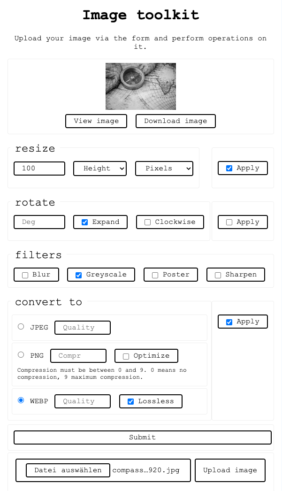

# IMAGE TOOLKIT
#### Video Demo:  <URL HERE>
## Description:
Image toolkit  is a service for basic image manipulation. It features a website where the user can upload an image for processing, as well as an API, powered by [Flask](https://flask.palletsprojects.com/).

### Links
- [Documentation is hosted on Github](https://reinimax.github.io/image-toolkit/)
- [Backend](https://reinimax.eu.pythonanywhere.com/image-process) and [Frontend](https://reinimax.eu.pythonanywhere.com/frontend/) are hosted on [Python Anywhere](https://www.pythonanywhere.com/)

### Installation
1. Set up virtual environment: `python3 -m venv .venv`
2. Activate virtual environment: `. .venv/bin/activate`
3. Install dependencies: `python -m pip install -r requirements.txt`

Note: You can exit the virtual environment by typing `deactivate`. [Learn more about virtual environments and package installation](https://packaging.python.org/en/latest/guides/installing-using-pip-and-virtual-environments/).

### Run the service locally

Activate the virtual environment and type `flask run`. If you want to use the frontend locally, you need to set up an additional local server 
(for development, I used the excellent [LiveServer](https://marketplace.visualstudio.com/items?itemName=ritwickdey.LiveServer) VSCode extension) and change the 
`BASE_URL`constant in `frontend/script.js` to point to Flasks local server.

### (Self-) Host the service

Refer to [Flask's documentation for deploying to production](https://flask.palletsprojects.com/en/3.0.x/deploying/). Again, for the frontend, you may need an additional server/hosting,
or to configure the WSGI server to serve the contents of the `frontend` directory statically. I use [Python anywhere](https://www.pythonanywhere.com/) to host the demo.

### Usage

#### via the web-interface (upload form)



**Note** that the web-interface implements most, but not all functionality of the API. This is intentional to further showcase the decoupled nature of this project.

#### via the API
There is one API endpoint, `/image-process`, which expects a `POST` request with a `JSON` payload.

Except the obligatory `Content-Type: application/json`, no additional headers and no authentication are required.

The `JSON` payload has two mandatory fields:

- `original_image`: base64-encoded image.
- `operations`: array of objects that define the operations to be performed on the image. Operations will be performed in order. If an invalid operation is given,
or a valid operation fails, the other operations will still be performed.

An `operation` object itself consists of a mandatory `name` field which specifies the operation that should be performed. The name is the same as the name of the processing function
that will be called to do the work.

Optionally, each operation accepts arguments that specify how the image should be processed, e.g. a width and/or height for resizing an image. Dimensions like width or height can be given to the API in different ways: Generally, it will accept units of pixels and percent. If the unit is pixels, it can be omitted, since this is assumed as the standard. These would all be valid arguments:
```
"width": "300px"
"width": "300" // 300px, as above
"width": 300
"width": 300.0 // this works too, but is considered bad practice
"width": "50%" // 50 percent
```

Optionally, within the key `return_as`, you can also provide a format in which the image should be returned, along with some options for image quality. Refer to the [Supported formats page](/api/formats/) for more details.
If `return_as` is ommitted or contains an invalid format, the image will be returned in the same format in which it was submitted.

A complete payload might look like this:
```
{
    "operations": [
        {
            "name": "rotate",
            "degrees": 180
        },
        {
            "name": "resize",
            "width": "50%",
        },
        // ... any other operations you like to perform.
    ],
    // optional return format and options
    "return_as": {
        "format": "webp",
        "quality": 80
    },
    "original_image": "..." // base64-encoded image
}
```

##### API response

A successful response from the API will look like this:
```
{
    "metadata": {
        "format": "jpeg", // format of the processed image
        // width and height of the processed image
        "height": 374,
        "width": 300
    },
    "processed_image": "..." // base64-encoded image
}
```

If you get back the original image, or some operations were not performed, this probably means you provided invalid/incomplete parameters to some operation(s). If you found a bug, feel free to [open an issue](https://github.com/reinimax/image-toolkit/issues).

If you really messed up the `JSON` payload or did not provide a correctly encoded image, you will get an error response instead:
```
{
    "error": "No image provided." // The error message will try to explain what caused the error.
}
```
However, I tried to design this API pretty robust and forgiving, so (hopefully) what you'll see more often is just some operation not being performed if you forgot an argument or mistyped something.

You can look up the available processing functions and the arguments they expect in the [API documentation](/api/operations/) (ignore the `image` argument, as this will be passed in automatically).

##### Accepted file formats
The [supported formats page](/api/formats/) lists the formats that the API is guaranteed to accept and return. Other image formats *may* work as input.
Refer to the [pillow documentation](https://pillow.readthedocs.io/en/stable/handbook/image-file-formats.html) to see which formats *may* work.

## A short tour of the repo
This repository consists of 4 main parts:

### The backend/API
This is a flask application, consisting of these files:

- `app.py`defines the routing and interface of the API.
- `operations.py` defines the available image manipulation operations.
- `formats.py` defines the supported formats that the API can convert images into.
- `helpers.py` defines some helper functions.
- `requirements.txt` defines the libraries used by the application.

### The frontend
tbd

### The documentation
The documentation is automatically generated from the README file and the docstrings from the source code of the API. It is located in the `docs` directory.

### Tooling for the documentation:
There are a number of files dedicated to auto-generating documentation and [integrating pdoc with mkdocs](https://github.com/mitmproxy/pdoc/tree/main/examples/mkdocs/):

- `mkdocs.yml` is the configuration file for creating a static site containing the documentation.
- `make.py` is a script that generates `pdoc` documentation and moves it to a directory and format where it can be picked off by `mkdocs`.
- The `pdoc-template` folder contains a template override and styling for `pdoc`, so that it better integrates with the generated `mkdocs`.
- The `mk-docs`folder contains an `index.md` file that links the README into the generated documentation and `custom.js` that does some cosmetic changes to better integrate the documentation generated by `pdoc`.

## Design decisions
- I decided to create just one API-endpoint and make the user provide the wanted operations as JSON payload. This is more user-friendly, because it lets you chain operations together in one single request.
- I tried out autogenerating API documentation using [flaskapi](https://github.com/apiflask/apiflask) and the [OpenAPI spec](https://www.openapis.org/), which is awesome in principle, but didn't convince me in the context of this project.
There is only one API endpoint, which takes a lot of parameters. OpenAPI is great if you have a lot of small endpoints and methods, but that's not the case here. What I really needed was
to document the single image manipulation operations. At the end, I decided to use [pdoc](https://pdoc.dev/), an easy to use library that generates pretty neat documentation and integrate it with [mkdocs](https://www.mkdocs.org/), linking this README file to the generated documentations index file using [pymdown-extensions](https://github.com/facelessuser/pymdown-extensions).
- In a similar vein, I looked into [APIflask](https://apiflask.com/) which has some neat features. But in the end I decided to stick with vanilla Flask and making some adoptions manually (e.g. making sure error responses are always sent as JSON instead of text/html). The reason is, I wanted to keep things simple and avoid the application being overloaded with features that I don't really use, especially since I decided against going with the OpenAPI approach.
- For implementing different formats in which the image can be returned, I decided to follow an approach very similar to the one for operations: Create a new file that defines saving functions and dynamically call them if a valid image format was submitted. I tried first a simpler approach with dynamically passing arguments to the `save` function of the `Image` class. This is less code, but I decided against it for 2 reasons: 
First, defining custom save functions allows for better auto-generated documentation. 
And second, perhaps more important, it allows for providing default arguments that are different from the ones provided by Pillow, and for additional validation.
The chosen approach is more verbose, but I find it also more robust and explicit.

## Acknowledgements
- Huge thanks to [HuggingChat](https://huggingface.co/chat/) for providing suggestions and feeback regarding some initial design decisions ([link to the chat](https://hf.co/chat/r/Oqo8rfK))
and for help with debugging some stuff.
- Huge thanks also to [Python anywhere](https://www.pythonanywhere.com/) which provides a free hosting tier, on which this project is hosted.
- This project would not have been possible without some amazing libraries. See below for a list of projects this project relies on.

## Powerd by
tbd list used libraries
